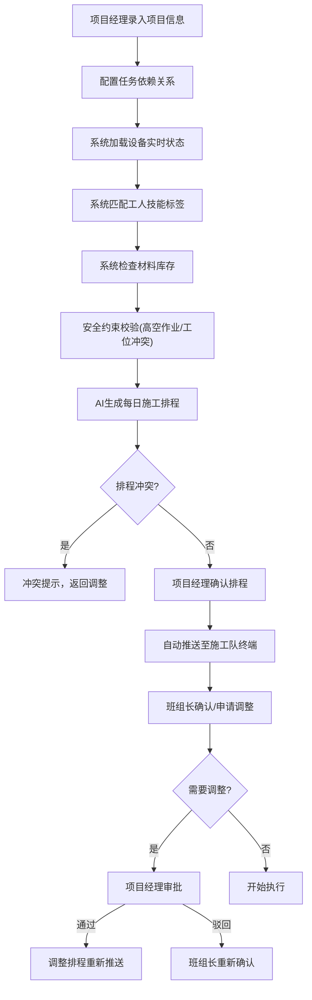
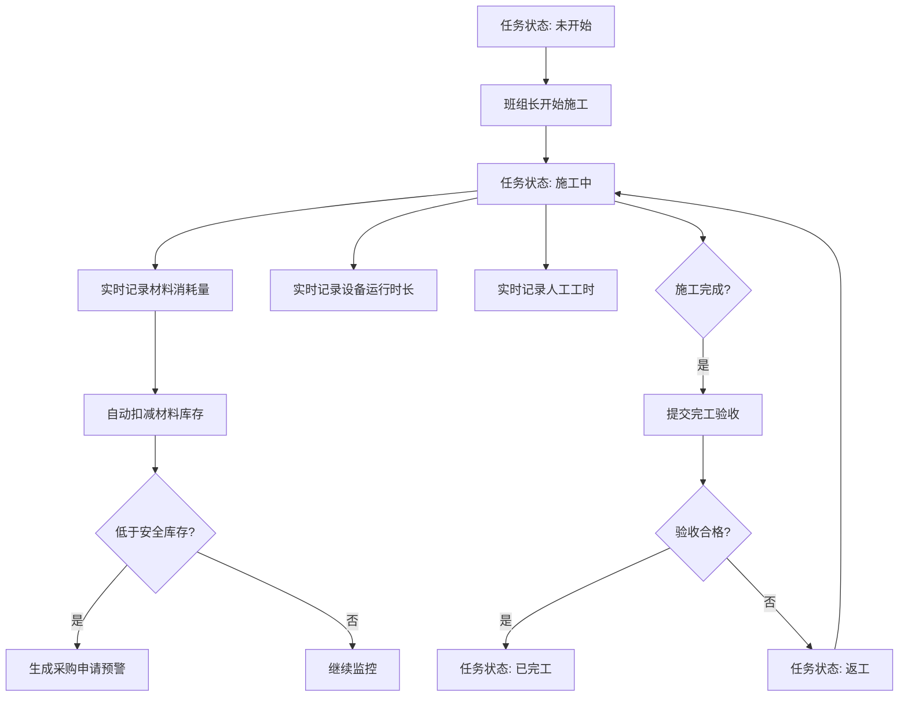
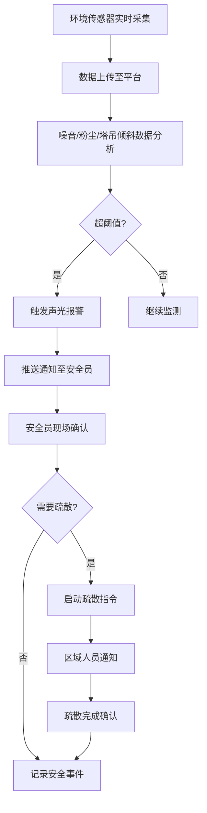

## 1. 产品概述

大型建筑工程项目管理与资源调度桌面系统，面向建筑施工企业的一体化智能管理平台。系统整合工程项目全生命周期管理，实现从项目立项、智能排程、施工执行、安全监测到统计分析的全流程数字化管控，解决传统建筑行业资源调度效率低、安全监管难、成本管控弱等核心痛点。

- 核心价值：通过AI智能排程优化资源配置，实时安全监测保障施工安全，全链路数据采集实现精细化成本管控
- 目标用户：建筑企业项目经理、施工班组长、安全员、设备管理员、材料管理员、企业管理层

## 2. 核心功能

### 2.1 用户角色

| 角色 | 注册方式 | 核心权限 |
|------|----------|----------|
| 项目经理 | 企业账号分配 | 项目全权限管理、排程审批、调整审批、采购审批、报表查看 |
| 施工班组长 | 企业账号分配 | 任务接收与确认、任务状态更新、调整申请、施工数据上报 |
| 安全员 | 企业账号分配 | 安全监测数据查看、报警处理、疏散指令发布、安全事故记录 |
| 设备管理员 | 企业账号分配 | 设备台账管理、维保工单处理、备件库存管理、设备状态监控 |
| 材料管理员 | 企业账号分配 | 材料库存管理、消耗记录、采购申请处理、预警处理 |
| 企业管理层 | 企业账号分配 | 多项目总览、综合统计报表、决策分析 |

### 2.2 功能模块

1. **项目信息管理**：项目信息录入、里程碑管理、预算管控、施工周期设置
2. **智能排程系统**：任务依赖管理、资源匹配算法、安全约束校验、冲突检测、排程生成与调整
3. **任务执行中心**：任务推送、状态流转、调整申请与审批、施工数据实时采集
4. **材料库存管理**：库存台账、消耗自动扣减、安全库存预警、采购申请生成
5. **安全监测系统**：环境传感器数据采集、阈值报警、声光告警、疏散指令、安全事件记录
6. **设备维保管理**：设备台账、运行时长统计、维保工单生成、备件库存扣减
7. **统计分析中心**：多维度统计、进度分析、成本分析、安全分析、PDF报告导出
8. **施工平面图监控**：区域热力分布、人力设备实时定位、施工状态可视化

### 2.3 页面详情

| 页面名称 | 模块名称 | 功能描述 |
|---------|----------|----------|
| 项目总览 | 项目列表、关键指标卡片、快速操作区 | 展示所有项目概览、进度、预算执行情况，支持快速进入各模块 |
| 项目详情 | 基本信息、里程碑时间线、预算执行图表 | 项目信息录入与编辑、里程碑增删改、预算执行情况可视化 |
| 智能排程 | 任务依赖图、资源甘特图、排程结果、冲突预警 | 可视化任务依赖配置、自动生成排程、冲突检测与提示、手动调整 |
| 任务中心 | 任务列表、状态看板、调整申请列表 | 按角色展示任务、拖拽式状态更新、申请提交与审批 |
| 材料管理 | 库存看板、消耗记录、预警列表、采购申请 | 实时库存展示、消耗自动统计、低库存高亮、一键生成采购单 |
| 安全监测 | 实时数据面板、报警历史、传感器地图、疏散指令 | 多参数实时曲线、超阈值声光报警、传感器位置展示、一键疏散 |
| 设备管理 | 设备台账、运行监控、维保工单、备件库存 | 设备档案管理、实时状态监控、工单自动分配、备件管理 |
| 统计分析 | 多维度统计图表、报告生成器、导出中心 | 按项目/工种/时间段统计、自定义报告、PDF导出 |
| 施工平面图 | 2D平面图、热力图层、设备定位、人力分布 | 交互式施工平面图、实时热力图、资源分布可视化 |

## 3. 核心流程

### 3.1 智能排程流程

### 3.2 施工执行与数据采集流程

### 3.3 安全监测流程

## 4. 用户界面设计

### 4.1 设计风格

- **主色调**：工业蓝 `#1E3A8A`，代表专业、稳重、可信赖
- **辅助色**：安全橙 `#EA580C`（预警/报警）、成功绿 `#16A34A`（正常/完成）、警示黄 `#EAB308`（警告）
- **中性色**：深灰 `#1F2937`、中灰 `#4B5563`、浅灰 `#9CA3AF`、背景 `#F8FAFC`
- **字体**：主标题使用 "Oswald" 工业风格字体，正文使用 "Inter" 清晰易读字体
- **按钮风格**：直角硬朗工业风，2px边框，hover状态有轻微上浮动效
- **布局风格**：左侧导航栏 + 顶部操作栏 + 主内容区，卡片式布局，网格对齐
- **图标风格**：线性图标搭配实心图标，工业感强，颜色与功能区对应

### 4.2 页面设计概述

| 页面名称 | 模块名称 | UI元素 |
|---------|----------|--------|
| 项目总览 | 项目列表 | 深色侧边栏导航、顶部搜索筛选、卡片式项目展示、进度圆环、预算对比柱状图、动画入场 |
| 智能排程 | 甘特图区 | 左右分栏布局，左侧任务树，右侧交互式甘特图，依赖关系连线，冲突高亮闪烁 |
| 安全监测 | 实时面板 | 仪表盘式数据展示，报警时全屏红色脉冲动画，声音警报，紧急疏散按钮醒目突出 |
| 施工平面图 | 2D地图 | 全屏交互平面图，可缩放平移，热力图层半透明叠加，设备图标动态闪烁 |
| 统计分析 | 图表中心 | 多图表网格布局，支持拖拽重排，数据筛选动效，导出按钮悬浮固定 |

### 4.3 响应式

- **桌面优先**：针对大尺寸显示器优化，支持1920×1080及以上分辨率
- **平板适配**：侧边栏可收起，图表自适应缩放
- **触控优化**：施工队终端页面针对触控操作优化，按钮尺寸增大，手势滑动支持

### 4.4 视觉动效

- **入场动画**：页面加载时元素从下往上渐入，错开0.1s延迟
- **数据更新**：数值变化时数字滚动动画，状态切换时颜色渐变
- **报警动画**：安全报警时红色边框脉冲闪烁，声音提示
- **交互动效**：按钮hover轻微上浮+阴影加深，卡片hover边框高亮
- **热力图动画**：人员密度变化时平滑过渡，不突兀跳变
