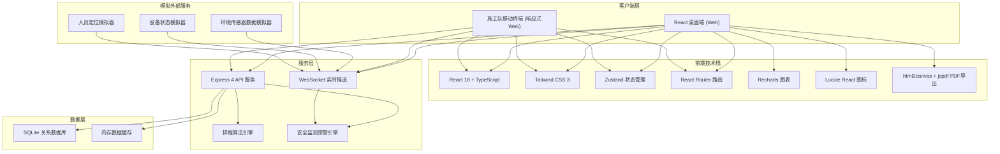
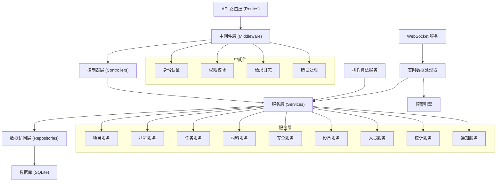

## 1. 架构设计



## 2. 技术描述

- **前端**: React@18 + TypeScript + TailwindCSS@3 + Vite
- **状态管理**: Zustand
- **路由**: React Router DOM
- **图表可视化**: Recharts
- **图标**: Lucide React
- **PDF导出**: jspdf + html2canvas
- **后端**: Express@4 + TypeScript + ESM
- **数据库**: SQLite (better-sqlite3)
- **实时通信**: WebSocket (ws)
- **初始化工具**: vite-init (react-express-ts 模板)
- **包管理**: pnpm

## 3. 路由定义

| 路由路径 | 页面名称 | 访问角色 |
|---------|---------|---------|
| / | 登录页 | 所有用户 |
| /dashboard | 项目总览 | 项目经理、管理层 |
| /projects | 项目列表 | 项目经理 |
| /projects/:id | 项目详情 | 项目经理 |
| /projects/:id/milestones | 里程碑管理 | 项目经理 |
| /scheduling | 智能排程 | 项目经理 |
| /tasks | 任务中心 | 所有角色 |
| /tasks/board | 任务看板 | 班组长、项目经理 |
| /tasks/adjustments | 调整申请审批 | 项目经理 |
| /materials | 材料库存管理 | 材料管理员 |
| /materials/purchase | 采购申请 | 材料管理员、项目经理 |
| /safety | 安全监测中心 | 安全员、项目经理 |
| /safety/alarms | 报警历史 | 安全员 |
| /equipment | 设备管理 | 设备管理员 |
| /equipment/maintenance | 维保工单 | 设备管理员 |
| /statistics | 统计分析 | 管理层、项目经理 |
| /statistics/report | 报告导出 | 管理层、项目经理 |
| /floorplan | 施工平面图 | 项目经理、安全员 |

## 4. API 定义

### 4.1 项目管理 API

```typescript
// 项目类型定义
interface Project {
  id: string;
  projectNo: string;
  name: string;
  budget: number;
  actualCost: number;
  startDate: string;
  endDate: string;
  status: 'planning' | 'in_progress' | 'completed' | 'suspended';
  description: string;
  location: string;
  createdAt: string;
}

interface Milestone {
  id: string;
  projectId: string;
  name: string;
  plannedDate: string;
  actualDate: string | null;
  status: 'pending' | 'in_progress' | 'completed' | 'delayed';
  description: string;
}

// API 端点
GET    /api/projects                  // 获取项目列表
POST   /api/projects                  // 创建项目
GET    /api/projects/:id              // 获取项目详情
PUT    /api/projects/:id              // 更新项目
DELETE /api/projects/:id              // 删除项目
GET    /api/projects/:id/milestones   // 获取项目里程碑
POST   /api/projects/:id/milestones   // 添加里程碑
PUT    /api/projects/:id/milestones/:mid // 更新里程碑
DELETE /api/projects/:id/milestones/:mid // 删除里程碑
```

### 4.2 排程与任务 API

```typescript
interface Task {
  id: string;
  projectId: string;
  name: string;
  description: string;
  dependencies: string[];
  skills: string[];
  estimatedDuration: number;
  status: 'pending' | 'not_started' | 'in_progress' | 'completed' | 'rework';
  startDate: string | null;
  endDate: string | null;
  assignedTeamId: string | null;
  workArea: string;
  isHighAltitude: boolean;
  materials: TaskMaterial[];
  equipment: TaskEquipment[];
}

interface Schedule {
  id: string;
  projectId: string;
  date: string;
  tasks: ScheduledTask[];
  status: 'draft' | 'confirmed' | 'published';
  conflicts: ScheduleConflict[];
}

interface ScheduleConflict {
  type: 'workstation' | 'equipment' | 'worker' | 'safety';
  description: string;
  severity: 'warning' | 'critical';
  taskIds: string[];
}

interface AdjustmentRequest {
  id: string;
  taskId: string;
  requesterId: string;
  reason: string;
  suggestedChange: string;
  status: 'pending' | 'approved' | 'rejected';
  approverId: string | null;
  createdAt: string;
}

// API 端点
POST   /api/scheduling/generate       // 生成排程
GET    /api/scheduling/:date          // 获取某日排程
PUT    /api/scheduling/:id/confirm    // 确认排程
PUT    /api/scheduling/:id/publish    // 发布排程
GET    /api/tasks                     // 获取任务列表
POST   /api/tasks                     // 创建任务
PUT    /api/tasks/:id                 // 更新任务
PATCH  /api/tasks/:id/status          // 更新任务状态
POST   /api/tasks/:id/adjustments     // 提交调整申请
GET    /api/adjustments               // 获取调整申请列表
PUT    /api/adjustments/:id/approve   // 审批调整申请
PUT    /api/adjustments/:id/reject    // 驳回调整申请
```

### 4.3 材料管理 API

```typescript
interface Material {
  id: string;
  code: string;
  name: string;
  unit: string;
  totalStock: number;
  reservedStock: number;
  availableStock: number;
  safetyStock: number;
  unitPrice: number;
  supplier: string;
}

interface MaterialConsumption {
  id: string;
  taskId: string;
  materialId: string;
  quantity: number;
  recordedBy: string;
  recordedAt: string;
}

interface PurchaseRequest {
  id: string;
  materialId: string;
  quantity: number;
  reason: string;
  status: 'draft' | 'pending' | 'approved' | 'rejected' | 'ordered' | 'received';
  requestedBy: string;
  approvedBy: string | null;
  createdAt: string;
}

// API 端点
GET    /api/materials                 // 获取材料列表
POST   /api/materials                 // 添加材料
PUT    /api/materials/:id             // 更新材料
GET    /api/materials/:id/consumptions // 获取消耗记录
POST   /api/materials/consume         // 记录材料消耗
GET    /api/materials/alerts          // 获取库存预警
GET    /api/purchase-requests         // 获取采购申请
POST   /api/purchase-requests         // 创建采购申请
PUT    /api/purchase-requests/:id/approve // 审批采购申请
```

### 4.4 安全监测 API

```typescript
interface Sensor {
  id: string;
  code: string;
  type: 'noise' | 'dust' | 'tower_crane' | 'temperature' | 'humidity';
  location: string;
  x: number;
  y: number;
  status: 'online' | 'offline' | 'fault';
  threshold: { warning: number; critical: number };
}

interface SensorReading {
  id: string;
  sensorId: string;
  value: number;
  timestamp: string;
  level: 'normal' | 'warning' | 'critical';
}

interface SafetyAlarm {
  id: string;
  sensorId: string;
  type: string;
  level: 'warning' | 'critical';
  message: string;
  timestamp: string;
  acknowledged: boolean;
  acknowledgedBy: string | null;
  acknowledgedAt: string | null;
}

interface EvacuationOrder {
  id: string;
  issuerId: string;
  area: string;
  reason: string;
  timestamp: string;
  status: 'active' | 'completed' | 'cancelled';
}

interface SafetyIncident {
  id: string;
  date: string;
  type: 'injury' | 'near_miss' | 'property_damage' | 'environmental';
  severity: 'minor' | 'moderate' | 'major' | 'fatal';
  description: string;
  location: string;
  reportedBy: string;
}

// API 端点
GET    /api/sensors                   // 获取传感器列表
GET    /api/sensors/:id/readings      // 获取传感器历史数据
GET    /api/safety/alarms             // 获取报警列表
POST   /api/safety/alarms/:id/acknowledge // 确认报警
POST   /api/safety/evacuation         // 发布疏散指令
GET    /api/safety/evacuation/current // 获取当前疏散状态
POST   /api/safety/evacuation/:id/complete // 完成疏散
GET    /api/safety/incidents          // 获取安全事件列表
POST   /api/safety/incidents          // 记录安全事件
```

### 4.5 设备管理 API

```typescript
interface Equipment {
  id: string;
  code: string;
  name: string;
  type: string;
  status: 'available' | 'in_use' | 'maintenance' | 'fault' | 'retired';
  location: string;
  totalRuntime: number;
  lastMaintenanceDate: string;
  nextMaintenanceHours: number;
  maintenanceThreshold: number;
  specifications: Record<string, string>;
}

interface EquipmentUsage {
  id: string;
  equipmentId: string;
  taskId: string;
  startTime: string;
  endTime: string | null;
  duration: number;
  operatorId: string;
}

interface MaintenanceWorkOrder {
  id: string;
  equipmentId: string;
  type: 'preventive' | 'corrective' | 'emergency';
  description: string;
  status: 'pending' | 'assigned' | 'in_progress' | 'completed';
  assignedTeamId: string | null;
  partsUsed: MaintenancePart[];
  scheduledDate: string;
  completedDate: string | null;
}

interface SparePart {
  id: string;
  name: string;
  code: string;
  stock: number;
  safetyStock: number;
  unitPrice: number;
}

interface MaintenancePart {
  sparePartId: string;
  quantity: number;
}

// API 端点
GET    /api/equipment                 // 获取设备列表
POST   /api/equipment                 // 添加设备
PUT    /api/equipment/:id             // 更新设备
POST   /api/equipment/:id/usage/start // 开始使用设备
POST   /api/equipment/:id/usage/end   // 结束使用设备
GET    /api/maintenance/workorders    // 获取维保工单
POST   /api/maintenance/workorders    // 创建维保工单
PUT    /api/maintenance/workorders/:id // 更新工单
POST   /api/maintenance/workorders/:id/complete // 完成工单
GET    /api/spare-parts               // 获取备件列表
POST   /api/spare-parts               // 添加备件
PUT    /api/spare-parts/:id           // 更新备件
```

### 4.6 人员与考勤 API

```typescript
interface Worker {
  id: string;
  employeeNo: string;
  name: string;
  teamId: string;
  skills: string[];
  certifications: string[];
  status: 'available' | 'on_site' | 'leave' | 'off_work';
  currentLocation: { x: number; y: number; area: string } | null;
  totalWorkHours: number;
}

interface Team {
  id: string;
  name: string;
  teamLeaderId: string;
  members: string[];
  type: string;
}

interface WorkHours {
  id: string;
  workerId: string;
  taskId: string;
  date: string;
  hours: number;
  overtime: number;
  recordedBy: string;
}

// API 端点
GET    /api/workers                   // 获取工人列表
POST   /api/workers                   // 添加工人
PUT    /api/workers/:id               // 更新工人
GET    /api/teams                     // 获取班组列表
POST   /api/workhours                 // 记录工时
GET    /api/workhours/statistics      // 工时统计
```

### 4.7 统计分析 API

```typescript
interface StatisticsQuery {
  projectId?: string;
  teamId?: string;
  startDate: string;
  endDate: string;
  groupBy: 'project' | 'team' | 'week' | 'month';
}

interface ProgressStat {
  projectId: string;
  projectName: string;
  plannedProgress: number;
  actualProgress: number;
  completionRate: number;
  delayedTasks: number;
  completedTasks: number;
  totalTasks: number;
}

interface MaterialStat {
  materialId: string;
  materialName: string;
  plannedUsage: number;
  actualUsage: number;
  overConsumptionRate: number;
  unitPrice: number;
  costVariance: number;
}

interface SafetyStat {
  period: string;
  totalAlarms: number;
  criticalAlarms: number;
  incidents: number;
  injuryIncidents: number;
  nearMisses: number;
  evacuationCount: number;
}

// API 端点
GET    /api/statistics/progress       // 进度统计
GET    /api/statistics/materials      // 材料统计
GET    /api/statistics/safety         // 安全统计
GET    /api/statistics/workhours      // 工时统计
GET    /api/statistics/equipment      // 设备统计
POST   /api/reports/generate          // 生成报告
GET    /api/reports/:id/download      // 下载PDF报告
```

### 4.8 施工平面图 API

```typescript
interface FloorPlan {
  id: string;
  projectId: string;
  name: string;
  width: number;
  height: number;
  areas: FloorArea[];
}

interface FloorArea {
  id: string;
  name: string;
  type: string;
  bounds: { x: number; y: number; width: number; height: number };
  status: 'active' | 'idle' | 'dangerous';
}

interface HeatmapData {
  areaId: string;
  workerCount: number;
  equipmentCount: number;
  intensity: number;
  timestamp: string;
}

interface LocationUpdate {
  entityType: 'worker' | 'equipment';
  entityId: string;
  x: number;
  y: number;
  area: string;
  timestamp: string;
}

// API 端点
GET    /api/floorplans/:projectId     // 获取施工平面图
GET    /api/floorplans/:projectId/heatmap // 获取热力图数据
GET    /api/floorplans/:projectId/locations // 获取实时位置
```

## 5. 服务端架构



## 6. 数据模型

### 6.1 ER 图

```mermaid
erDiagram
    PROJECT ||--o{ MILESTONE : contains
    PROJECT ||--o{ TASK : contains
    PROJECT ||--o{ FLOOR_PLAN : has
    
    TASK ||--o{ TASK_DEPENDENCY : "depends on"
    TASK ||--o{ TASK_MATERIAL : requires
    TASK ||--o{ TASK_EQUIPMENT : requires
    TASK ||--o{ MATERIAL_CONSUMPTION : has
    TASK ||--o{ EQUIPMENT_USAGE : has
    TASK ||--o{ WORK_HOURS : has
    TASK ||--o{ ADJUSTMENT_REQUEST : has
    
    TEAM ||--o{ WORKER : has
    WORKER ||--o{ WORK_HOURS : logs
    TEAM ||--o{ TASK : "assigned to"
    
    MATERIAL ||--o{ TASK_MATERIAL : "used in"
    MATERIAL ||--o{ MATERIAL_CONSUMPTION : "consumed in"
    MATERIAL ||--o{ PURCHASE_REQUEST : "requested for"
    
    EQUIPMENT ||--o{ TASK_EQUIPMENT : "used in"
    EQUIPMENT ||--o{ EQUIPMENT_USAGE : "used in"
    EQUIPMENT ||--o{ MAINTENANCE_WORK_ORDER : has
    
    SPARE_PART ||--o{ MAINTENANCE_PART : "used in"
    MAINTENANCE_WORK_ORDER ||--o{ MAINTENANCE_PART : contains
    
    SENSOR ||--o{ SENSOR_READING : produces
    SENSOR ||--o{ SAFETY_ALARM : triggers
    
    FLOOR_PLAN ||--o{ FLOOR_AREA : contains
    
    USER ||--o{ ADJUSTMENT_REQUEST : "requests/reviews"
    USER ||--o{ PURCHASE_REQUEST : "requests/reviews"
    USER ||--o{ SAFETY_ALARM : acknowledges
    USER ||--o{ EVACUATION_ORDER : issues
    USER ||--o{ SAFETY_INCIDENT : reports
    
    PROJECT {
        string id PK
        string projectNo
        string name
        decimal budget
        decimal actualCost
        date startDate
        date endDate
        string status
        string location
        string description
    }
    
    MILESTONE {
        string id PK
        string projectId FK
        string name
        date plannedDate
        date actualDate
        string status
        string description
    }
    
    TASK {
        string id PK
        string projectId FK
        string name
        string description
        int estimatedDuration
        string status
        date startDate
        date endDate
        string assignedTeamId FK
        string workArea
        boolean isHighAltitude
    }
    
    TASK_DEPENDENCY {
        string taskId FK
        string dependentTaskId FK
    }
    
    TASK_MATERIAL {
        string taskId FK
        string materialId FK
        decimal quantity
    }
    
    TASK_EQUIPMENT {
        string taskId FK
        string equipmentId FK
        decimal estimatedHours
    }
    
    TEAM {
        string id PK
        string name
        string teamLeaderId FK
        string type
    }
    
    WORKER {
        string id PK
        string employeeNo
        string name
        string teamId FK
        string skills
        string certifications
        string status
        decimal totalWorkHours
    }
    
    WORK_HOURS {
        string id PK
        string workerId FK
        string taskId FK
        date date
        decimal hours
        decimal overtime
    }
    
    MATERIAL {
        string id PK
        string code
        string name
        string unit
        decimal totalStock
        decimal reservedStock
        decimal safetyStock
        decimal unitPrice
        string supplier
    }
    
    MATERIAL_CONSUMPTION {
        string id PK
        string taskId FK
        string materialId FK
        decimal quantity
        string recordedBy
        datetime recordedAt
    }
    
    PURCHASE_REQUEST {
        string id PK
        string materialId FK
        decimal quantity
        string reason
        string status
        string requestedBy
        string approvedBy
        datetime createdAt
    }
    
    EQUIPMENT {
        string id PK
        string code
        string name
        string type
        string status
        string location
        decimal totalRuntime
        date lastMaintenanceDate
        decimal nextMaintenanceHours
        decimal maintenanceThreshold
    }
    
    EQUIPMENT_USAGE {
        string id PK
        string equipmentId FK
        string taskId FK
        datetime startTime
        datetime endTime
        decimal duration
        string operatorId
    }
    
    MAINTENANCE_WORK_ORDER {
        string id PK
        string equipmentId FK
        string type
        string description
        string status
        string assignedTeamId
        date scheduledDate
        date completedDate
    }
    
    SPARE_PART {
        string id PK
        string code
        string name
        int stock
        int safetyStock
        decimal unitPrice
    }
    
    MAINTENANCE_PART {
        string workOrderId FK
        string sparePartId FK
        int quantity
    }
    
    SENSOR {
        string id PK
        string code
        string type
        string location
        decimal x
        decimal y
        string status
        decimal warningThreshold
        decimal criticalThreshold
    }
    
    SENSOR_READING {
        string id PK
        string sensorId FK
        decimal value
        datetime timestamp
        string level
    }
    
    SAFETY_ALARM {
        string id PK
        string sensorId FK
        string type
        string level
        string message
        datetime timestamp
        boolean acknowledged
        string acknowledgedBy
        datetime acknowledgedAt
    }
    
    EVACUATION_ORDER {
        string id PK
        string issuerId
        string area
        string reason
        datetime timestamp
        string status
    }
    
    SAFETY_INCIDENT {
        string id PK
        date date
        string type
        string severity
        string description
        string location
        string reportedBy
    }
    
    FLOOR_PLAN {
        string id PK
        string projectId FK
        string name
        int width
        int height
    }
    
    FLOOR_AREA {
        string id PK
        string floorPlanId FK
        string name
        string type
        decimal x
        decimal y
        decimal width
        decimal height
        string status
    }
    
    USER {
        string id PK
        string username
        string name
        string role
        string passwordHash
    }
    
    ADJUSTMENT_REQUEST {
        string id PK
        string taskId FK
        string requesterId FK
        string reason
        string suggestedChange
        string status
        string approverId
        datetime createdAt
    }
    
    SCHEDULE {
        string id PK
        string projectId FK
        date date
        string status
        text conflicts
    }
```



### 6.2 核心排程算法说明

**排程算法流程：**
1. **任务拓扑排序**：基于依赖关系构建有向无环图，进行拓扑排序确定任务执行顺序
2. **资源匹配**：
   - 工人技能匹配：任务所需技能 ∩ 工人技能集
   - 设备可用性检查：设备状态 + 时间段冲突检测
   - 材料库存验证：可用库存 ≥ 任务需求量
3. **安全约束校验**：
   - 高空作业限制：同时高空作业人数 ≤ 最大允许人数
   - 工位冲突检测：同一工位同一时间段任务数 ≤ 1
   - 作业时间限制：危险作业必须在白天进行
4. **冲突检测与解决**：
   - 识别资源冲突、时间冲突、安全冲突
   - 按优先级自动调整或人工干预
5. **排程优化**：
   - 关键路径优先
   - 资源均衡利用
   - 最短工期优化
